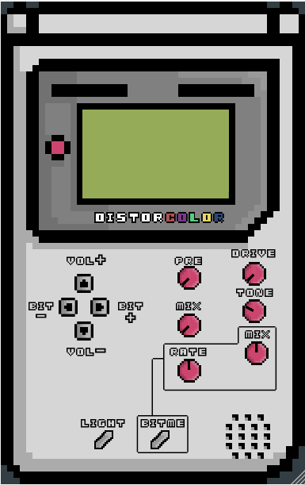
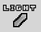
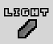
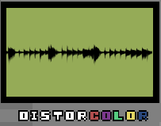
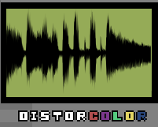

DistorColor 

DistorColor is our take on distortion. 
It can be used to boost the incoming signal via the PRE knob, give it some colour by the TONE shaping and the DRIVE control.
It offers two types of distortions, an hard fuzzy one and a soft clip one, plus a bit crusher effect.

The first thing noticeable when the plug in is active is the filtering, which is always on.
DistorColor has a filter section based on 2 filters: high-pass and low-pass.
The former's frequency cutoff is fixed at 80 Hz, the latter's one can be adjusted in the range 4000 kHz to 6000 kHz, by default is fixed at 4550 Hz.

TYPE 1 

The default type of distortion sounds like a fuzz pedal powered by an almost dead battery.
When in this mode you can hear the distorted sound by turning the MIX knob up while having the DRIVE at zero. 
Our advice is to never go past 12 o'clock with the DRIVE knob in this mode, past that limit results in a very harsh and noisy sound (pretty much uncontrollable and useless).

TYPE 2

The second mode is the LIGHT mode (LIGHT button).
This mode is a soft clip distortion, unlike the type 1 this mode has much less gain. In fact when turning up the MIX knob with the DRIVE at zero nothing changes. 
In this mode we suggest to bring the drive up to 12 o'clock and then slowly rise the MIX, there is a lot more headroom so the clipping happens later with respect of the other mode which clips immediately.  
Soft clip is much more dynamic and amp-like than type 1, is easy to come up with nice low gain sounds.
Past 12 o'clock the DRIVE knob gives a thick saturated sound. 

BIT CRUSHER

We all know what a bit crusher is and how it sounds like. If you don't know yet, just press the BITME button and find it out.
The Bit Crusher is designed to go alongside the two distortion modes.
Other than the usual suonds that a bit crusher can give, there is a more useful way to use it in this context: noise gate. 
As said before type 1 distortion can be noisy and uncontrollable, set the RATE knob to its minimum position and start decreasing the bit by BIT +/- the unwanted noise 
should be minimized, adjust the bit crusher MIX knob to balance between the distorted sound and the bit crushed one.

AUDIO VISUALIZER 

An useful tool is the audio visualizer, it can be seen the difference between a non distorted signal and a distorted one. 
  

USAGE

0. Open DistorColor in the DAW of choice (Live, Reaper, Garage Band...FL Studio not fully supported)

1. Run some audio into it with the MIX knob at 0 (the output volume is set at 0 by default)

2. Increase the DRIVE knob, about 9/10 o'clock (remeber what said for type 1 distortion)

3. Turn up the MIX to hear the actual distortion

4. Balance the output volume with the VOL+ / VOL- buttons

5. Once the volume is set, so it doesn't clip in the DAW of choice, set the DRIVE and TONE to taste

6. Use the PRE knob if you want to hear the original signal (not distorted) in the mix

7. Press the BITME button to engage the Bit Crusher effect alongside the distortion

8. Modify the Bit Crusher parameters by using the MIX, RATE knobs and the BIT+ / BIT- buttons

10. If you feel like using a lot of distortion in either the two modes, use the Bit Crusher to act as a noise gate 
    
    (set the BIT to where you don't hear noise when no sound is playing, then adjust the MIX and RATE to taste)

12. Make some cool music and get rich (if so, email us please)

NOTES on the PRE Knob

The PRE knob can be used to boost the signal in case one wants only a boost in volume, and in general to hear the dry (un-effected signal) with the effected one.

 Be careful with this control, it can clip almost immediately, especially with the drive section engaged (use the VOL buttons to balance the overall output).